# Sportsbook-Lite Journey Tests Documentation

## Overview

The Journey Tests project provides comprehensive end-to-end testing for the Sportsbook-Lite application using a Fluent Builder pattern. These tests validate complete user journeys from wallet funding through bet placement and payout, ensuring all system components work together correctly.

## Architecture

### Fluent Journey Builder Pattern

The core of the testing framework is the `SportsbookJourneyBuilder` class, which provides a fluent, readable API for constructing complex test scenarios:

```csharp
var context = await new SportsbookJourneyBuilder(client, output)
    .CreateUser("john_doe")
    .FundWallet(1000m, "USD")
    .CreateEvent("Premier League Final", SportType.Football)
    .PlaceBet(100m, "home_win", 2.10m)
    .CompleteEvent("home_win")
    .VerifyBalance(1110m)
    .ExecuteAsync();
```

## User Journey Flow Diagrams

### 1. Happy Path User Journey

```mermaid
graph TD
    Start[Start Journey] --> CreateUser[Create User]
    CreateUser --> FundWallet[Fund Wallet $1000]
    FundWallet --> BrowseEvents[Browse Available Events]
    BrowseEvents --> CheckOdds[Check Odds for Selection]
    CheckOdds --> PlaceBet[Place Bet $100]
    PlaceBet --> VerifyBalance1[Verify Balance: $900]
    VerifyBalance1 --> WaitEvent[Wait for Event Start]
    WaitEvent --> EventLive[Event Goes Live]
    EventLive --> EventComplete[Event Completes]
    EventComplete --> Settlement[Bet Settlement Processing]
    Settlement --> CheckResult{Bet Result?}
    CheckResult -->|Won| Payout[Receive Payout $210]
    CheckResult -->|Lost| NoP payout[No Payout]
    Payout --> VerifyBalance2[Verify Final Balance: $1110]
    NoPayout --> VerifyBalance3[Verify Final Balance: $900]
    
    style Start fill:#e1f5e1
    style VerifyBalance2 fill:#e1f5e1
    style VerifyBalance3 fill:#ffe1e1
```

### 2. Event Administrator Journey

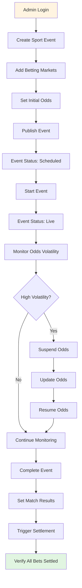

### 3. Cashout Journey

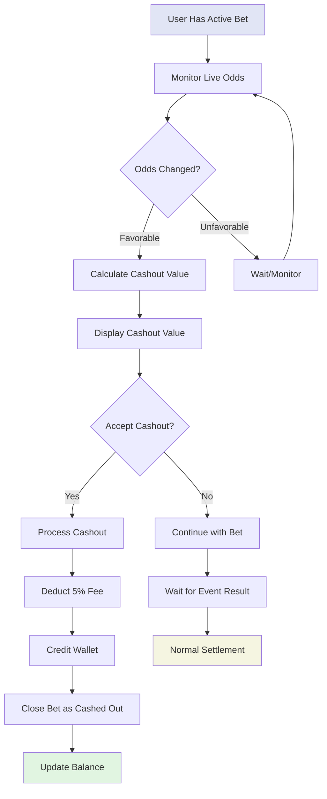

## Sequence Diagrams

### Bet Placement Sequence

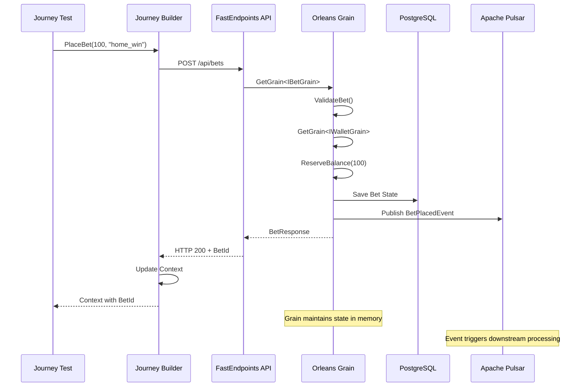

### Concurrent Betting Synchronization

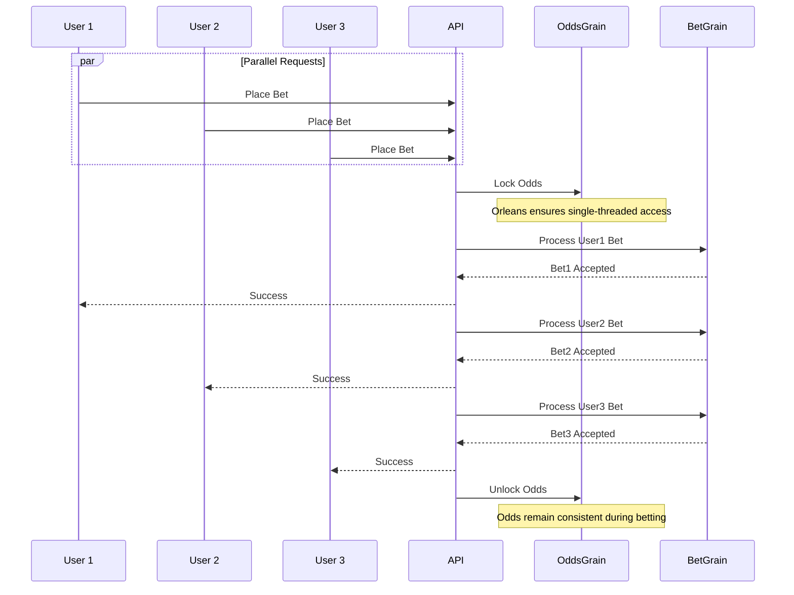

### Settlement Saga Pattern

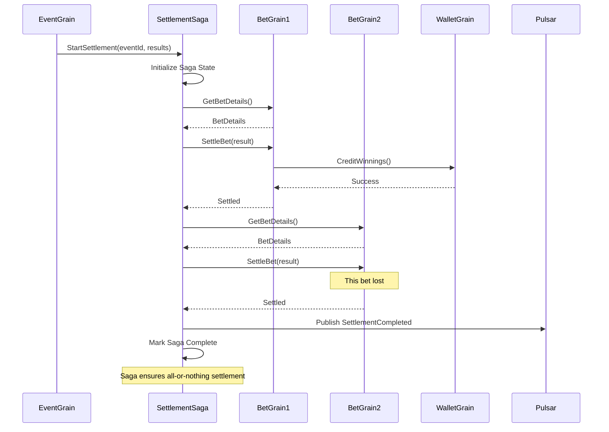

## State Diagrams

### Bet Lifecycle States

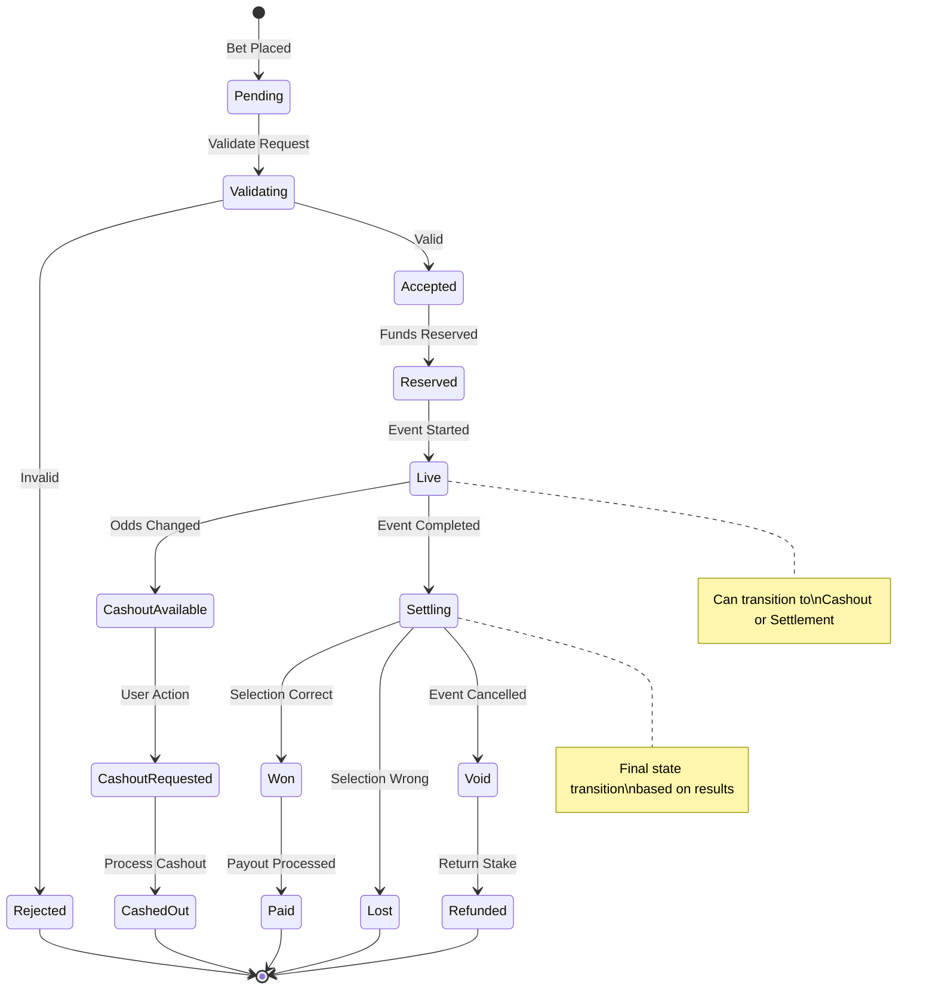

### Event Lifecycle States

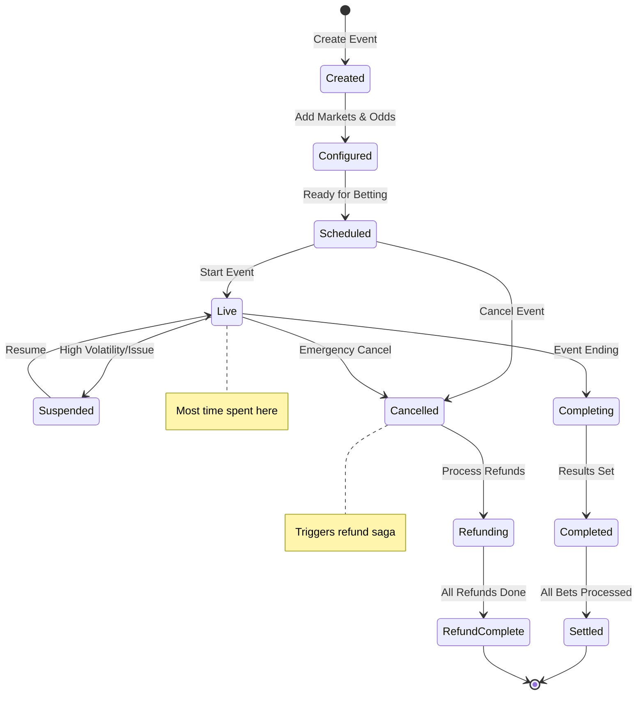

### Wallet Transaction States

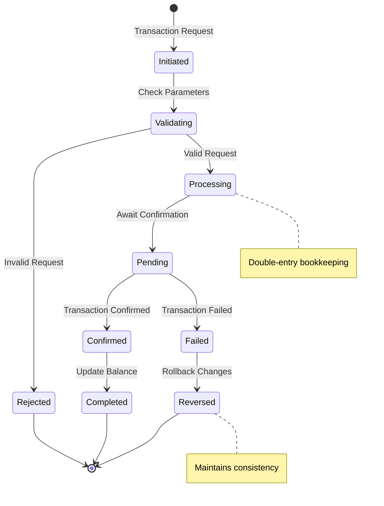

## Test Infrastructure Architecture

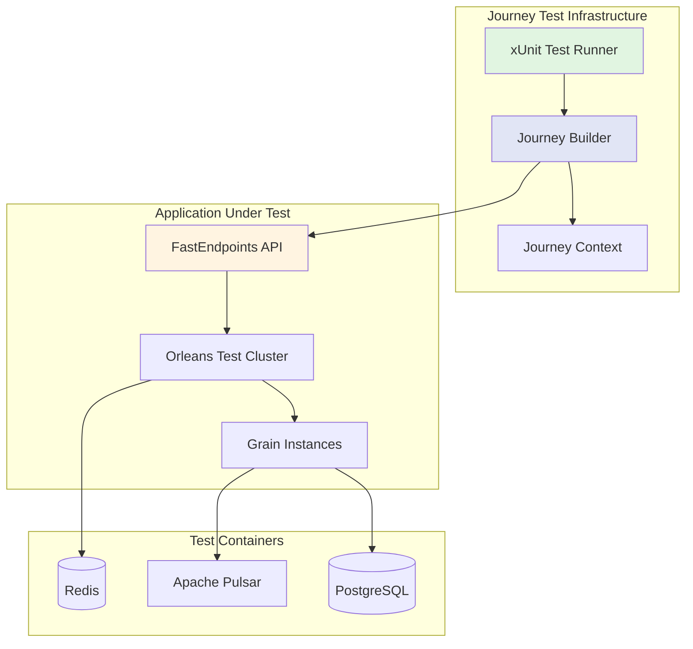

## Journey Builder Class Hierarchy

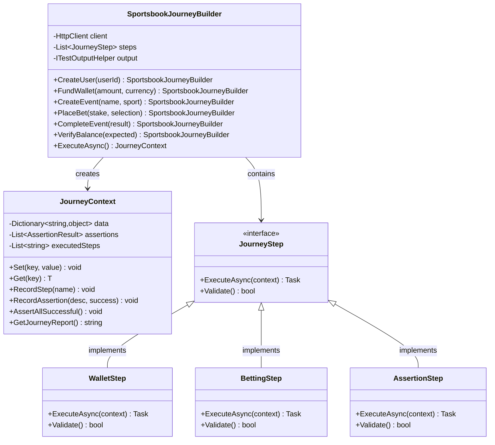

## Data Flow Through System

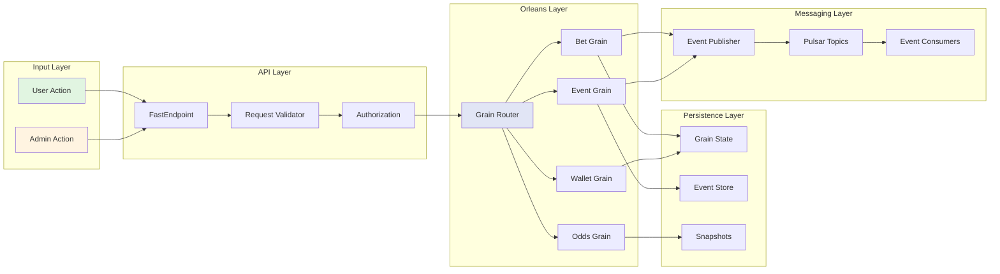

## Test Execution Flow

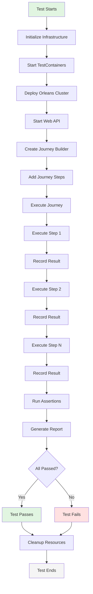

## Performance Testing Strategy

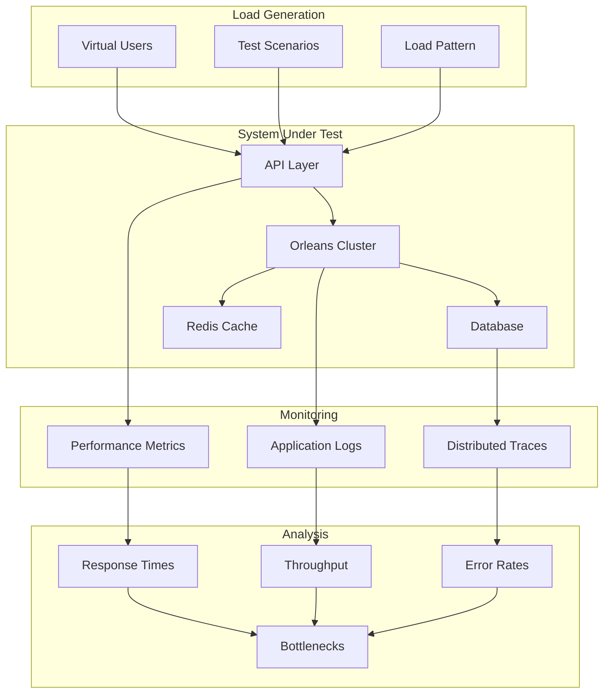

## Key Testing Patterns

### 1. Idempotency Testing
Tests verify that duplicate requests with the same idempotency key return the same result without side effects.

### 2. Concurrent User Simulation
Multiple virtual users perform actions simultaneously to test system concurrency handling.

### 3. State Verification
After each action, the system state is verified to ensure consistency across all components.

### 4. Error Recovery Testing
Simulates failures and verifies the system's ability to recover gracefully.

### 5. Performance Benchmarking
Measures response times and throughput under various load conditions.

## Running the Tests

### Prerequisites
- .NET 9 SDK
- Docker Desktop (for TestContainers)
- Sufficient system resources (8GB RAM minimum)

### Execution Commands

```bash
# Run all journey tests
dotnet test tests/SportsbookLite.JourneyTests

# Run specific test category
dotnet test --filter "Category=HappyPath"

# Run with detailed output
dotnet test --logger "console;verbosity=detailed"

# Run with performance profiling
dotnet test --collect:"XPlat Code Coverage"
```

### CI/CD Integration

```yaml
name: Journey Tests
on: [push, pull_request]

jobs:
  journey-tests:
    runs-on: ubuntu-latest
    steps:
    - uses: actions/checkout@v3
    - name: Setup .NET
      uses: actions/setup-dotnet@v3
      with:
        dotnet-version: 9.0.x
    - name: Run Journey Tests
      run: dotnet test tests/SportsbookLite.JourneyTests --logger trx
    - name: Publish Test Results
      uses: dorny/test-reporter@v1
      if: always()
      with:
        name: Journey Test Results
        path: '**/*.trx'
        reporter: dotnet-trx
```

## Test Coverage Matrix

| Journey Type | Coverage | Priority | Automated |
|-------------|----------|----------|-----------|
| Happy Path | User registration to payout | High | ✅ |
| Admin Operations | Event lifecycle management | High | ✅ |
| Concurrent Betting | Multi-user scenarios | High | ✅ |
| Cashout Flows | Early settlement | Medium | ✅ |
| Error Recovery | Failure handling | High | ✅ |
| Performance | Load testing | Medium | ✅ |
| Edge Cases | Boundary conditions | Low | ⚠️ |

## Conclusion

The Journey Tests provide comprehensive validation of the Sportsbook-Lite application through realistic user scenarios. The Fluent Builder pattern ensures tests are readable, maintainable, and accurately reflect real-world usage patterns. The integration with TestContainers and Orleans TestCluster provides a realistic testing environment that closely mirrors production behavior.